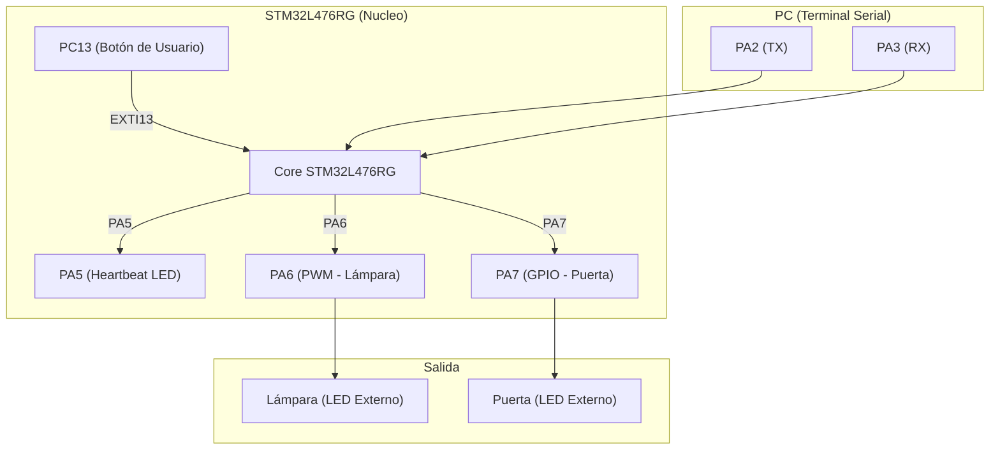
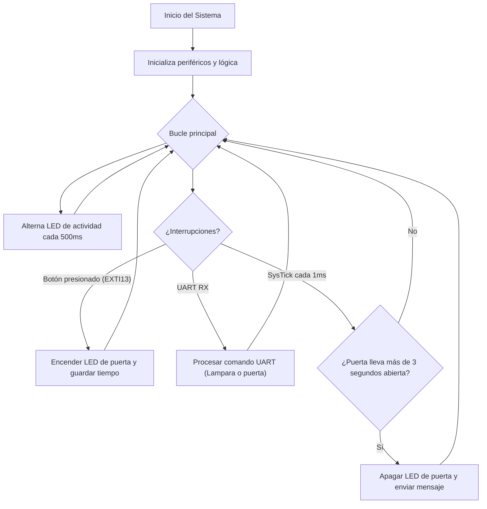

# Manual de Usuario – Sistema de Control de Sala (STM32L476RG)

**Curso:** Estructuras Computacionales
**Universidad Nacional de Colombia – Sede Manizales**

---

## 📟 Introducción

Este sistema implementa un **controlador básico para una sala**, que permite:

* **Controlar el brillo de una lámpara** mediante PWM (PA6).
* **Controlar una puerta** mediante un botón físico (PC13) o comandos remotos UART (PA2/PA3).
* **Monitorear eventos** vía comunicación UART a 115200 baudios.

El sistema está programado en **C puro** accediendo directamente a los registros del STM32L476RG, sin HAL ni CMSIS.

---

## 🔌 Diagrama de Conexiones (Mermaid)

---

## 📡 Comandos UART

| Comando | Acción                            |
| ------: | --------------------------------- |
|   `'1'` | Encender lámpara al 100%          |
|   `'2'` | Encender lámpara al 70%           |
|   `'3'` | Encender lámpara al 50% (default) |
|   `'4'` | Encender lámpara al 20%           |
|   `'0'` | Apagar lámpara                    |
|   `'o'` | Abrir puerta remotamente          |
|   `'c'` | Cerrar puerta remotamente         |

Baudios: `115200`, Configuración: `8N1`

---

## 🔄 Lógica de Funcionamiento (Mermaid Flowchart)

---

## ⚠️ Recomendaciones

* Verifica las conexiones físicas del LED de puerta (PA7) y de lámpara (PA6) con resistencias apropiadas.
* Usa una terminal serial como **PuTTY**, **CoolTerm** o la integrada en **VS Code** para enviar comandos.
* Evita presionar el botón repetidamente en menos de 50 ms (anti-rebote).
* Recuerda que la puerta se cerrará automáticamente después de 3 segundos.

---

## 🧪 Comprobación rápida

1. **Compila y carga** el firmware.
2. **Abre la terminal UART** a 115200 baudios.
3. Presiona el botón B1 o envía comandos para validar el comportamiento.

---
